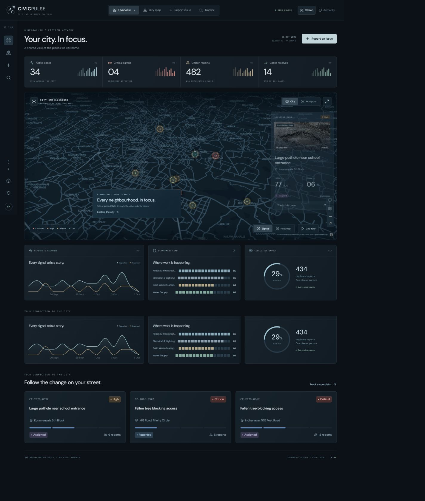
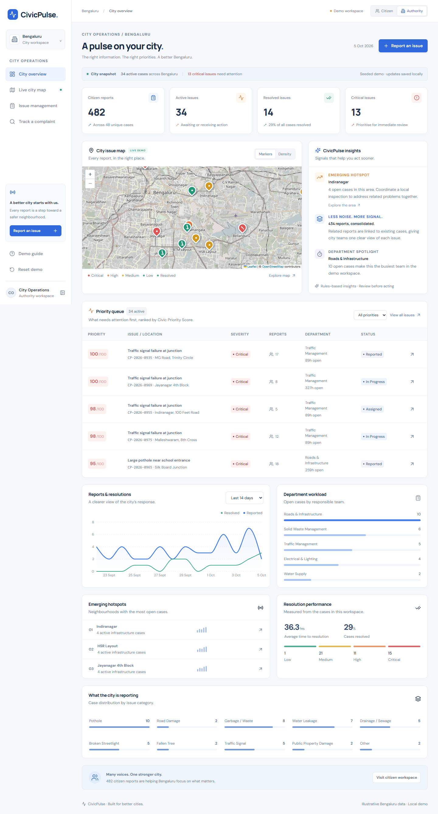
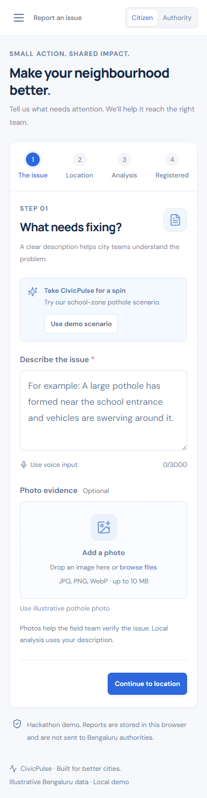
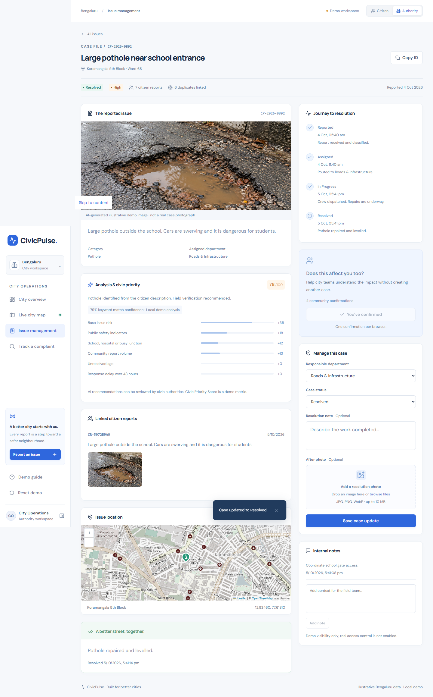

# CivicPulse

**Report city problems. Help teams fix what matters first.**

CivicPulse is an open source civic issue demo built for the WEBNOVA hackathon. It turns citizen reports in Bengaluru into a shared, ranked view of problems, connects repeat reports to one case, and shows the case’s progress to citizens and city teams.

**Repository:** [github.com/praveen8723/CivicPulse](https://github.com/praveen8723/CivicPulse)

> **Demo notice:** The cases, photos, statistics, authority roles, and updates in this app are illustrative. CivicPulse does not submit complaints to the government. Data you enter stays in your browser.

## See it in action

- [Watch the product tour](public/demo/civicpulse-tour.webm)
- [Three-minute pitch and judge Q&A](docs/PITCH.md)
- [Verification notes](docs/VERIFICATION.md)

| Citizen workspace | Authority workspace |
| --- | --- |
|  |  |

| Report an issue | Track a resolved case |
| --- | --- |
|  |  |

More views are in [`docs/screenshots/`](docs/screenshots/), including the mobile workspace, duplicate analysis, and map previews.

## Why CivicPulse exists

When several people report the same pothole, a team needs one case backed by several reports. CivicPulse groups likely duplicates, scores urgency using visible factors, suggests the responsible public office, and gives citizens a way to follow progress. The goal is a clearer path from **report → triage → action → verification**.

## What you can do

| For citizens | For city teams (simulated) |
| --- | --- |
| Describe a problem, add a photo, choose a location, and submit a report. | Review a ranked queue, map, hotspots, workload, and trends. |
| See whether a report joins an existing case and confirm community impact. | Filter cases, change ownership and status, and publish updates. |
| Track a case and upload a confirmation photo after repair. | Upload an after-photo and review both sides of resolution evidence. |

The demo also includes English and Kannada interface options, browser speech input where supported, a guided Bengaluru map tour, CSV export, and links to official complaint channels. Its priority score uses safety language, category risk, sensitive locations, community volume, age, and response delay. Duplicate matching checks category, distance, text overlap, and recency.

## Run locally

**Requirements:** Node.js 22 or newer and npm. No database, account, or API key is required.

```bash
git clone https://github.com/praveen8723/CivicPulse.git
cd CivicPulse
npm ci
npm run dev
```

Open [http://127.0.0.1:3000](http://127.0.0.1:3000). Use **Reset demo** in the sidebar to restore the seeded cases before a walkthrough.

### Optional local AI

The analysis route first tries a local Ollama server with `llama3.2:latest`. If it is unavailable, deterministic keyword rules keep reporting functional. To use Ollama:

```bash
ollama pull llama3.2
ollama serve
```

Copy `.env.example` to `.env.local` to change `OLLAMA_MODEL` or the loopback-only `OLLAMA_BASE_URL`. You can also configure `ISSUE_ANALYSIS_URL` and `ISSUE_ANALYSIS_KEY` for a trusted external fallback. The endpoint receives `{ "description": "..." }` and returns `{ "category": "Pothole", "confidence": 0.9, "summary": "..." }`. Keep the key server-side; never commit `.env.local`. Uploaded images are not sent to either analysis service.

### Quality checks

```bash
npm run typecheck
npm run lint
npm test
npm run build
```

For browser tests, install Playwright’s Chrome browser once with `npx playwright install chrome`, start the app with `npm run dev`, then run `npm run test:e2e` in another terminal. See the [verification record](docs/VERIFICATION.md) for tested journeys and known limits.

## Try the three-minute demo

1. Open the **Authority** workspace and show the ranked queue, city map, and hotspots.
2. Choose **Report an issue → Use demo scenario**, then select Koramangala 5th Block.
3. Analyse and submit the school-zone pothole report. The existing master case gains a citizen report instead of creating another issue.
4. Open the tracker, then the authority view. Change the status to **In Progress** and publish an update.
5. Add an authority after-photo and a citizen confirmation photo. Resolution appears only after both are present.

The seeded dataset contains 48 illustrative cases. Counts in the interface are computed from those records, not from live municipal systems.

## Technology and project structure

- **Interface:** Next.js App Router, React, TypeScript, CSS, Lucide, and Recharts.
- **Maps:** MapLibre GL for the city view and React Leaflet for precise location picking. Map tiles need an internet connection.
- **State:** A shared React provider and a browser `localStorage` repository, with same-origin cross-tab updates.
- **Analysis:** A Next.js route handler tries local Ollama, then an optional provider, then keyword rules.

| Path | Purpose |
| --- | --- |
| `app/` | Pages, styles, and `/api/analyze` route. |
| `components/` | Reporting, maps, dashboards, case details, and shared UI. |
| `lib/` | Seed data, scoring, duplicate matching, routing, and translations. |
| `services/` | Classification client and issue repository. |
| `types/` | Shared civic domain types. |
| `tests/` | Domain and browser journey checks. |
| `docs/` | Pitch, verification record, and screenshots. |

### Deploy on Netlify

The included [`netlify.toml`](netlify.toml) builds the Next.js app with `npm run build` and publishes `.next`; Netlify handles the server route through its Next.js runtime. Connect the GitHub repository in Netlify, keep the production branch as `main`, and use Node.js 22. Each push to `main` can then trigger a deployment. No environment variables are needed for the keyword analysis fallback. If you use an external analysis service, add its URL and key as Netlify environment variables.

On Netlify, a local Ollama process is not bundled with the site. The server route falls back to the configured provider or keyword rules. The current 42-second local Ollama attempt may delay first-time analysis on hosted deployments; a production integration should use a reachable service with a short timeout.

## Demo boundaries and roadmap

This is a working hackathon prototype, not a municipal service. Authority access is simulated; anyone can open the authority view. Cases, updates, and uploaded photos persist only in the current browser and can be reset or lost when browser data is cleared. Independent browsers do not share data, and concurrent edits are not protected by server-side transactions. AI confidence is an estimate, image pixels are not analysed, and the sample imagery is fictional or AI-generated. Official office suggestions still require agency review.

A pilot would need authenticated roles, durable storage, atomic updates, verified ward and agency routing, privacy controls, independently evaluated classification, accessibility review, and real notification and government integrations.

## Team and contributions

**CivicPulse team:** [Praveen Hiremath](https://github.com/praveen8723), project maintainer. Built for the WEBNOVA hackathon. If you contributed to the project, please add your name and role here through a pull request.

Contributions are welcome. Open an issue with the problem and reproduction steps, or submit a pull request with a focused change. Run the quality checks above before proposing code changes. Keep demo cases clearly labelled as illustrative and do not add real personal complaint data to the repository.

## License and credits

The original CivicPulse source code and project-owned demo assets are available under the [MIT License](LICENSE). Third-party libraries and map data retain their own terms. Map data © OpenStreetMap contributors; attribution appears in the interface. Icons are from Lucide. Fonts use DM Sans and Manrope. Generated case illustrations and resolution images are fictional demo assets and are labelled separately from user evidence.

For published civic contact links and the app’s verification history, see [docs/VERIFICATION.md](docs/VERIFICATION.md) and the in-app official contact panel.
