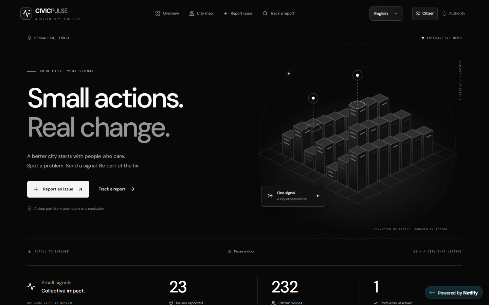
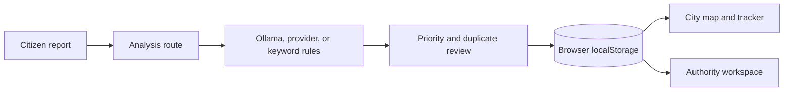
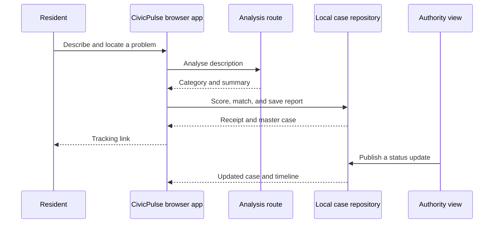

# CivicPulse

CivicPulse brings citizen reports and city-team triage into one view. It groups reports about the same problem, explains what needs attention first, and lets residents follow a case from report to resolution.

Built for the WEBNOVA hackathon. **Project team:** [Praveen Hiremath](https://github.com/praveen8723), maintainer.

Try the working demo: [civicpulse-praveen.netlify.app](https://civicpulse-praveen.netlify.app)

> **This is a demo.** Its Bengaluru cases and statistics are illustrative. Reports are saved in your browser and are not sent to a government agency.

## The problem we picked

Several people can report the same pothole, broken light, or blocked drain. If each report becomes a separate ticket, city teams lose the full picture and residents cannot see whether anyone is acting on the problem.

CivicPulse turns related reports into one case with a visible priority, suggested public office, and shared progress record. The aim is to help teams decide what to review first while giving residents a clear way to track the issue.

## What the demo does

A resident can describe a problem, add a photo, choose a Bengaluru location, and submit a report. The app then:

- classifies the description and suggests a responsible department;
- calculates an explainable Civic Priority Score;
- checks for a nearby, recent report about the same type of issue;
- adds a matching report to the existing master case or creates a new case;
- shows the case on the city map, in the tracker, and in the authority workspace.

The authority view can change a case's status and department, publish progress, and add a repair photo. A case is marked resolved only after an authority after-photo and a citizen confirmation photo are present. The interface supports English and Kannada, map hotspots, CSV export, and browser speech input where available.



[Authority workspace](docs/screenshots/authority-workspace.png) · [Report flow](docs/screenshots/report-flow.png) · [60-second product tour](public/demo/civicpulse-tour.webm)

## Why prioritization matters

A complaint count alone does not tell a team what is urgent. CivicPulse combines category risk, safety language, sensitive locations, community reports, case age, and response delay into a score from 0 to 100. The factors are visible on the case page, so a team can review the recommendation instead of treating it as an unexplained verdict.

Duplicate matching uses the same category, distance within 250 metres, description overlap, and a recent unresolved case. Community volume is capped so popularity alone cannot determine urgency. These are demo rules that need evaluation with real, labelled cases before a pilot.

## How CivicPulse works

The report form sends the **description** to `/api/analyze`. That server route tries a local Ollama model, then an optional external provider, then keyword rules. Uploaded photos are not sent to the analysis service. The browser applies priority and duplicate rules, saves cases locally, and gives the map, tracker, and authority workspace the same data.

### Architecture



The `IssueRepository` contract separates case operations from the interface. Its current adapter uses `localStorage`; a production adapter would need a server database, authenticated roles, and atomic updates.

## Follow one report through the app



In this prototype, the resident and authority views share data only inside the same browser origin. Independent users do not see each other's changes.

## Project layout

| Path | What is there |
| --- | --- |
| `app/` | Next.js pages, styles, and the analysis route |
| `components/` | Report wizard, map, tracker, dashboards, and shared UI |
| `lib/` | Seed cases, scoring, duplicate detection, department rules, and translations |
| `services/` | Classification client and issue repository |
| `types/` | Shared civic data types |
| `public/` | Demo images, product tour, icons, and map assets |
| `tests/` | Domain and browser journey tests |
| `netlify.toml` | Netlify build configuration |

## Run it locally

You need Node.js 22 or newer and npm. No database, account, or API key is required.

```bash
git clone https://github.com/praveen8723/CivicPulse.git
cd CivicPulse
npm ci
npm run dev
```

Open [http://127.0.0.1:3000](http://127.0.0.1:3000). `npm ci` also copies the MapLibre worker files needed by the browser.

To use local AI, install Ollama, run `ollama pull llama3.2`, then start `ollama serve`. The app still works without it by using keyword rules. Copy `.env.example` to `.env.local` if you need to change the local model or configure `ISSUE_ANALYSIS_URL` and `ISSUE_ANALYSIS_KEY` for a trusted external fallback. Never commit `.env.local`.

Run the checks with:

```bash
npm run typecheck
npm run lint
npm test
npm run build
```

For browser tests, install Chrome for Playwright with `npx playwright install chrome`, keep `npm run dev` running, and run `npm run test:e2e` in another terminal.

## A quick walkthrough

1. Open the **Authority** workspace. Show the ranked cases, city map, and hotspots.
2. Open **Report an issue** and choose **Use demo scenario**. Select Koramangala 5th Block.
3. Analyse the school-zone pothole. The app finds the nearby master case with six citizen reports.
4. Add your report. That case gains a seventh report rather than creating a second issue.
5. Open its tracker, switch to the authority view, change the status to **In Progress**, and publish an update.
6. Return to the tracker to see the same progress. Add an authority after-photo and a citizen confirmation photo to demonstrate resolution.

Use **Reset demo** in the sidebar before repeating the walkthrough. The starting dataset contains 48 illustrative cases.

## A few choices we made

**One problem, one case.** A new report can strengthen an existing case while keeping its own receipt and history.

**Explain the priority.** The score is a review aid, with its factors shown beside the case rather than hidden behind an AI label.

**Keep the demo runnable.** Keyword analysis works without a model or API key. The Netlify deployment uses this fallback because it cannot run a local Ollama process.

**Separate illustration from evidence.** Case illustrations and sample resolution photos are labelled as fictional or AI-generated. A real uploaded photo is displayed separately.

## Limits of this prototype

This is not an official reporting channel. Authority access is simulated, and anyone can open that view. Cases and uploaded photos stay in the current browser; clearing browser data removes them, and independent browsers do not share data. Simultaneous edits are not protected by server transactions. Classification confidence is an estimate, image pixels are not analysed, and suggested public offices require agency review. Map tiles need an internet connection.

The current build is a hackathon demo, not a production security or accessibility certification.

## What we would build next

A municipal pilot would add verified resident and staff roles, durable storage with safe concurrent updates, tested ward boundaries and agency routing, privacy controls, consent-based notifications, accessibility review, and measured accuracy for classification and duplicate matching.

## Deploying

The live demo is hosted on Netlify. `netlify.toml` sets Node.js 22, runs `npm run build`, and publishes `.next-netlify`. Netlify's Next.js runtime handles the server route. The separate build directory also lets a local development server remain open during a CLI deployment.

The current site was published with the Netlify CLI. After logging in and linking this project, deploy with:

```bash
npx netlify-cli deploy --prod
```

Git-triggered deployment is **not configured yet**. To enable it, connect this repository to the Netlify project and choose `main` as the production branch. No environment variables are required for the keyword fallback; keep any external analysis key in Netlify environment variables.

## License and credits

CivicPulse is released under the [MIT License](LICENSE). Map data © OpenStreetMap contributors, with attribution in the interface. Icons come from Lucide; the interface uses DM Sans and Manrope. Project-owned demo images are illustrative and do not depict verified civic complaints.
